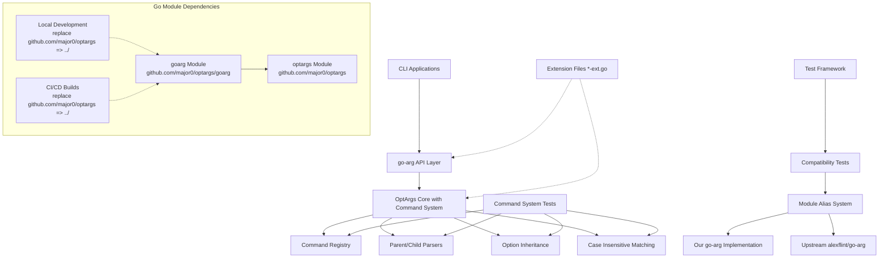
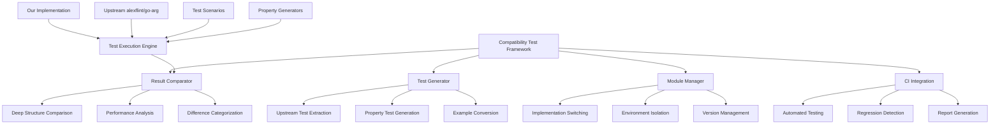

# Design Document

## Overview

This design implements a complete go-arg compatibility layer that provides 100% API compatibility with alexflint/go-arg while leveraging OptArgs Core's POSIX/GNU compliance and advanced command system. The architecture is intentionally simple: go-arg interfaces directly with OptArgs Core without intermediate layers.

Key enhancements include:
- **Full Command System Integration**: Direct use of OptArgs Core's command/subcommand system
- **Case Insensitive Commands**: Flexible command matching for improved usability
- **Option Inheritance**: Parent-to-child option inheritance through parser hierarchy
- **Enhanced POSIX/GNU Compliance**: Access to OptArgs Core's advanced parsing features

Extensions are handled architecturally through `-ext.go` files that can be included/excluded at build time.

## Architecture

## Architecture

### Enhanced Two-Layer Architecture with Command System and Module Dependencies



### Core Principles

1. **Direct Integration**: go-arg interfaces directly with OptArgs Core including its command system
2. **Perfect Compatibility**: 100% API compatibility with alexflint/go-arg
3. **Enhanced Command System**: Full integration with OptArgs Core's hierarchical command system
4. **Case Insensitive Commands**: Flexible command matching for improved user experience
5. **Option Inheritance**: Parent-to-child option inheritance through parser hierarchy
6. **Architectural Extensions**: Enhanced features through `-ext.go` files
7. **Build-Time Configuration**: Extensions included/excluded at compile time
8. **Zero Runtime Overhead**: No runtime extension system complexity
9. **Module Independence**: Standalone Go module with proper dependency management
10. **Cascading Builds**: Optimized build system that responds to dependency changes

## Module Dependency Management

### Go Module Structure

The goarg package is implemented as an independent Go module with proper dependency management:

```go
// goarg/go.mod
module github.com/major0/optargs/goarg

go 1.23.4

require github.com/major0/optargs v0.0.0

// Local development - replace with parent module
replace github.com/major0/optargs => ../

// Module alias configuration for compatibility testing
// Uncomment to test with upstream alexflint/go-arg:
// replace github.com/alexflint/go-arg => github.com/alexflint/go-arg v1.4.3
```

### Dependency Configuration Modes

**Local Development Mode:**
- Uses `replace github.com/major0/optargs => ../` for local file system access
- Enables rapid development and testing with immediate changes
- Supports debugging across module boundaries

**CI/CD Build Mode:**
- Uses local replacement during automated testing
- Validates integration with current optargs development state
- Ensures compatibility before release

**Production Mode:**
- Depends on published optargs module via git URL
- Uses semantic versioning for stable releases
- Supports standard Go module operations (go get, go mod download)

### Build System Integration

The build system enhances existing GitHub workflows rather than creating duplicates. The existing `.github/workflows/build.yml` and `.github/workflows/coverage.yml` are extended to handle all modules:

```yaml
# Enhanced GitHub Actions workflow logic (extends existing workflows)
- name: Detect changes
  run: |
    # Detect changes across all modules
    if git diff --name-only HEAD~1 | grep -E '^(api_stability_test\.go|benchmark_test\.go|command\.go|...)$'; then
      echo "OPTARGS_CHANGED=true" >> $GITHUB_ENV
    fi
    if git diff --name-only HEAD~1 | grep -E '^(goarg/|optargs/)'; then
      echo "GOARG_CHANGED=true" >> $GITHUB_ENV
    fi
    if git diff --name-only HEAD~1 | grep -E '^(pflags/|goarg/|optargs/)'; then
      echo "PFLAGS_CHANGED=true" >> $GITHUB_ENV
    fi

# Existing optargs job continues unchanged
- name: Build OptArgs Core
  if: needs.detect-changes.outputs.optargs-changed == 'true'
  # ... existing logic

# New goarg job added to existing workflow
- name: Build GoArg Module
  if: needs.detect-changes.outputs.goarg-changed == 'true'
  working-directory: goarg
  # ... goarg-specific build logic

# New pflags job added to existing workflow
- name: Build PFlags Module
  if: needs.detect-changes.outputs.pflags-changed == 'true'
  working-directory: pflags
  # ... pflags-specific build logic
```

**Key Principles:**
- **Single Source of Truth**: One set of workflow files handles all modules
- **Intelligent Triggering**: Only builds modules when their sources or dependencies change
- **No Duplication**: Extends existing workflows rather than creating new ones
- **Centralized Management**: All build logic in existing `.github/workflows/` directory

### Script Flexibility Requirements

All validation scripts must be modified to accept an optional target directory parameter while defaulting to the current working directory. This enables the scripts to work with different module directories:

```bash
# Example: Enhanced validate_coverage.sh script header
#!/bin/bash
# Coverage validation script - works with any module directory
# Usage: ./scripts/validate_coverage.sh [target_directory] [coverage_file]

set -e

# Parse arguments
TARGET_DIR="${1:-.}"  # Default to current directory if not specified
COVERAGE_FILE="${2:-coverage.out}"

# Change to target directory if specified
if [[ "$TARGET_DIR" != "." ]]; then
    echo "Validating coverage in directory: $TARGET_DIR"
    cd "$TARGET_DIR"
fi

# Rest of script works with current directory
if [[ ! -f "$COVERAGE_FILE" ]]; then
    echo "Error: Coverage file $COVERAGE_FILE not found in $(pwd)"
    echo "Run 'make coverage' first to generate coverage data"
    exit 1
fi

# Script continues with normal logic...
```

**Usage Examples:**
```bash
# From project root - validate optargs
./scripts/validate_coverage.sh

# From project root - validate goarg
./scripts/validate_coverage.sh goarg/

# From project root - validate pflags
./scripts/validate_coverage.sh pflags/

# From within goarg directory
cd goarg && ../scripts/validate_coverage.sh

# From within pflags directory
cd pflags && ../scripts/validate_coverage.sh
```

## Components and Interfaces

### Main go-arg API (100% Compatible)

```go
// Package goarg provides 100% compatibility with alexflint/go-arg
package goarg

import "github.com/major0/optargs"

// Parser provides the main parsing interface - identical to alexflint/go-arg
type Parser struct {
    config   Config
    dest     interface{}
    metadata *StructMetadata

    // Direct OptArgs Core integration
    coreParser *optargs.Parser
    shortOpts  map[byte]*optargs.Flag
    longOpts   map[string]*optargs.Flag
}

// Config matches alexflint/go-arg configuration options exactly
type Config struct {
    Program     string
    Description string
    Version     string
    IgnoreEnv   bool
    // ... all other alexflint/go-arg config fields
}

// Main parsing functions - identical signatures to alexflint/go-arg
func Parse(dest interface{}) error
func ParseArgs(dest interface{}, args []string) error
func MustParse(dest interface{})
func NewParser(config Config, dest interface{}) (*Parser, error)

// Parser methods - identical to alexflint/go-arg
func (p *Parser) Parse(args []string) error
func (p *Parser) WriteHelp(w io.Writer)
func (p *Parser) WriteUsage(w io.Writer)
func (p *Parser) Fail(msg string)
```

### Struct Metadata Processing

```go
// StructMetadata represents parsed struct information
type StructMetadata struct {
    Fields      []FieldMetadata
    Subcommands map[string]*StructMetadata
    Program     string
    Description string
    Version     string
}

// FieldMetadata represents a single struct field's CLI mapping
type FieldMetadata struct {
    Name        string
    Type        reflect.Type
    Tag         string
    Short       string
    Long        string
    Help        string
    Required    bool
    Positional  bool
    Env         string
    Default     interface{}

    // Direct OptArgs Core mapping
    CoreFlag    *optargs.Flag
    ArgType     optargs.ArgType
}

// TagParser processes struct tags - identical behavior to alexflint/go-arg
type TagParser struct{}

func (tp *TagParser) ParseStruct(dest interface{}) (*StructMetadata, error)
func (tp *TagParser) ParseField(field reflect.StructField) (*FieldMetadata, error)
```

### Direct OptArgs Core Integration

```go
// CoreIntegration handles direct translation to OptArgs Core
type CoreIntegration struct {
    metadata    *StructMetadata
    shortOpts   map[byte]*optargs.Flag
    longOpts    map[string]*optargs.Flag
    positionals []PositionalArg
}

type PositionalArg struct {
    Field    *FieldMetadata
    Required bool
    Multiple bool
}

// Direct translation methods
func (ci *CoreIntegration) BuildOptString() string
func (ci *CoreIntegration) BuildLongOpts() []optargs.Flag
func (ci *CoreIntegration) CreateParser(args []string) (*optargs.Parser, error)
func (ci *CoreIntegration) ProcessResults(parser *optargs.Parser, dest interface{}) error
```

### Type Conversion System

```go
// TypeConverter handles all Go type conversions - identical to alexflint/go-arg
type TypeConverter struct{}

func (tc *TypeConverter) ConvertValue(value string, targetType reflect.Type) (interface{}, error)
func (tc *TypeConverter) SetField(field reflect.Value, value interface{}) error
func (tc *TypeConverter) GetDefault(field reflect.StructField) interface{}

// Support all alexflint/go-arg types
func (tc *TypeConverter) ConvertString(value string) string
func (tc *TypeConverter) ConvertInt(value string) (int, error)
func (tc *TypeConverter) ConvertBool(value string) (bool, error)
func (tc *TypeConverter) ConvertSlice(values []string, elementType reflect.Type) (interface{}, error)
func (tc *TypeConverter) ConvertCustom(value string, targetType reflect.Type) (interface{}, error)
```

## Data Models

### Struct Tag Processing Examples

```go
// All alexflint/go-arg tag formats must be supported identically
type ExampleStruct struct {
    // Basic options
    Verbose bool   `arg:"-v,--verbose" help:"enable verbose output"`
    Count   int    `arg:"-c,--count" help:"number of items"`

    // Required options
    Input   string `arg:"--input,required" help:"input file path"`

    // Positional arguments
    Files   []string `arg:"positional" help:"files to process"`

    // Environment variables
    Token   string `arg:"--token,env:API_TOKEN" help:"API authentication token"`

    // Default values
    Port    int    `arg:"-p,--port" default:"8080" help:"server port"`

    // Subcommands
    Server  *ServerCmd `arg:"subcommand:server"`
    Client  *ClientCmd `arg:"subcommand:client"`
}

type ServerCmd struct {
    Port int    `arg:"-p,--port" default:"8080" help:"server port"`
    Host string `arg:"-h,--host" default:"localhost" help:"server host"`
}
```

### OptArgs Core Mapping

```go
// Example of how struct tags map to OptArgs Core flags
type FlagMapping struct {
    StructField *FieldMetadata
    CoreFlag    *optargs.Flag
    ShortOpt    byte    // 'v' for -v
    LongOpt     string  // "verbose" for --verbose
    ArgType     optargs.ArgType
}

// Direct mapping without intermediate layers
func (fm *FlagMapping) ToOptArgsFlag() *optargs.Flag {
    return &optargs.Flag{
        Name:   fm.LongOpt,
        HasArg: fm.ArgType,
    }
}
```

## Architectural Extensions

### Extension File Structure

Extensions are implemented as separate files with `-ext.go` suffix:

```
goarg/
├── parser.go              // Base go-arg implementation
├── tags.go                // Struct tag processing
├── types.go               // Type conversion
├── help.go                // Help generation
├── core_integration.go    // OptArgs Core integration
├── parser_ext.go          // Enhanced parsing features
├── tags_ext.go            // Enhanced tag processing
└── core_integration_ext.go // Enhanced OptArgs Core features
```

### Extension Implementation Pattern

```go
// Base implementation in parser.go
func (p *Parser) Parse(args []string) error {
    // Standard alexflint/go-arg compatible parsing
    return p.parseStandard(args)
}

// Enhanced implementation in parser_ext.go
//go:build extensions
// +build extensions

func (p *Parser) parseWithExtensions(args []string) error {
    // Enhanced parsing with POSIX compaction, GNU features, etc.
    return p.parseEnhanced(args)
}

// Build-time selection
func (p *Parser) Parse(args []string) error {
    if extensionsEnabled {
        return p.parseWithExtensions(args)
    }
    return p.parseStandard(args)
}
```

### Build Configuration

```go
// Build tags for extension control
//go:build extensions
// +build extensions

const extensionsEnabled = true

// Standard build (no extensions)
//go:build !extensions
// +build !extensions

const extensionsEnabled = false
```

## Correctness Properties

*A property is a characteristic or behavior that should hold true across all valid executions of a system-essentially, a formal statement about what the system should do. Properties serve as the bridge between human-readable specifications and machine-verifiable correctness guarantees.*

<function_calls>
<invoke name="prework">
<parameter name="featureName">goarg-compatibility
### Property-Based Testing Overview

Property-based testing (PBT) validates software correctness by testing universal properties across many generated inputs. Each property is a formal specification that should hold for all valid inputs.

### Core Principles

1. **Universal Quantification**: Every property must contain an explicit "for all" statement
2. **Requirements Traceability**: Each property must reference the requirements it validates
3. **Executable Specifications**: Properties must be implementable as automated tests
4. **Comprehensive Coverage**: Properties should cover all testable acceptance criteria

### Converting EARS to Properties

Based on the prework analysis, here are the correctness properties:

**Property 1: Complete API Compatibility**
*For any* valid alexflint/go-arg struct definition and argument list, our go-arg implementation should produce identical parsing results to upstream alexflint/go-arg
**Validates: Requirements 1.1, 1.3**

**Property 2: Struct Tag Format Support**
*For any* valid alexflint/go-arg struct tag format, our tag parser should interpret it identically to upstream alexflint/go-arg
**Validates: Requirements 1.2, 4.1**

**Property 3: OptArgs Core Integration**
*For any* parsing operation, our implementation should leverage OptArgs Core's native parsing capabilities and produce results consistent with OptArgs Core's enhanced POSIX/GNU compliance
**Validates: Requirements 2.2**

**Property 4: Compatibility Test Framework Correctness**
*For any* test scenario, the compatibility framework should correctly identify whether both implementations produce equivalent results
**Validates: Requirements 3.2**

**Property 5: Type Conversion Compatibility**
*For any* Go type supported by alexflint/go-arg, our type converter should handle value conversion identically to upstream alexflint/go-arg
**Validates: Requirements 4.2**

**Property 6: Help Generation Compatibility**
*For any* struct definition, our help generator should produce help text identical in format and content to upstream alexflint/go-arg
**Validates: Requirements 5.1**

**Property 7: Error Message Compatibility**
*For any* invalid input that causes parsing errors, our error messages should match upstream alexflint/go-arg format and wording
**Validates: Requirements 5.2**

**Property 8: Performance Efficiency**
*For any* argument list size, parsing time should scale linearly and be competitive with or better than upstream alexflint/go-arg
**Validates: Requirements 7.1**

**Property 9: Option Inheritance Correctness**
*For any* parent parser with options and child parser with subcommands, options defined in the parent should be accessible and functional when used with child subcommands
**Validates: Requirements 2.6, 2.8**

**Property 10: Case Insensitive Command Matching**
*For any* registered command name, all case variations (uppercase, lowercase, mixed case) should resolve to the same command parser
**Validates: Requirements 2.7**

**Property 11: Command System Integration**
*For any* struct with subcommand fields, the go-arg layer should correctly register and dispatch to OptArgs Core's command system
**Validates: Requirements 2.6**

## Error Handling

### Direct Error Translation

Error handling maintains perfect compatibility with alexflint/go-arg while leveraging OptArgs Core's enhanced diagnostics:

```go
// Error translation from OptArgs Core to go-arg format
type ErrorTranslator struct{}

func (et *ErrorTranslator) TranslateError(err error, context ParseContext) error {
    switch {
    case strings.Contains(err.Error(), "unknown option"):
        // Match alexflint/go-arg error format exactly
        return fmt.Errorf("unrecognized argument: %s", extractOption(err))
    case strings.Contains(err.Error(), "option requires an argument"):
        return fmt.Errorf("option requires an argument: %s", extractOption(err))
    default:
        // Preserve original error if no specific translation needed
        return err
    }
}

type ParseContext struct {
    StructType reflect.Type
    FieldName  string
    TagValue   string
}
```

### Enhanced Diagnostics (Extensions)

When extension files are included, enhanced diagnostic information is available:

```go
// Enhanced error handling in error_ext.go
//go:build extensions
// +build extensions

func (et *ErrorTranslator) TranslateErrorWithEnhancements(err error, context ParseContext) error {
    baseErr := et.TranslateError(err, context)

    // Add enhanced diagnostic information from OptArgs Core
    if diagnostic, ok := err.(*optargs.DiagnosticError); ok {
        return &EnhancedError{
            BaseError:  baseErr,
            Diagnostic: diagnostic,
            Context:    context,
        }
    }

    return baseErr
}
```

## Testing Strategy

### Dual Testing Approach

- **Unit tests**: Verify specific functionality and edge cases
- **Property tests**: Verify universal properties across all valid inputs
- **Compatibility tests**: Compare behavior with upstream alexflint/go-arg using module aliases

### Module Alias Testing Framework

```go
// Test framework supports implementation switching
type TestSuite struct {
    scenarios []TestScenario
    upstream  bool  // Switch between implementations
}

type TestScenario struct {
    Name        string
    StructDef   interface{}
    Args        []string
    Expected    interface{}
    ShouldError bool
}

// Run tests against both implementations
func (ts *TestSuite) RunCompatibilityTests() *CompatibilityReport {
    report := &CompatibilityReport{}

    for _, scenario := range ts.scenarios {
        // Test our implementation
        ourResult := ts.runWithOurImplementation(scenario)

        // Test upstream implementation
        upstreamResult := ts.runWithUpstreamImplementation(scenario)

        // Compare results
        comparison := ts.compareResults(ourResult, upstreamResult)
        report.AddComparison(scenario.Name, comparison)
    }

    return report
}
```

### Module Alias Configuration

```bash
# Test with our implementation
go mod edit -replace github.com/alexflint/go-arg=./goarg
go test ./compatibility_tests/...

# Test with upstream implementation
go mod edit -dropreplace github.com/alexflint/go-arg
go test ./compatibility_tests/...
```

### Property-Based Testing Configuration

- Minimum 100 iterations per property test
- Each property test must reference its design document property
- Tag format: **Feature: goarg-compatibility, Property {number}: {property_text}**
- Extension tests validate enhanced features when extension files are included

### Test Categories

1. **API Compatibility Tests**
   - All alexflint/go-arg public methods
   - Struct tag parsing equivalence
   - Type conversion equivalence
   - Error handling compatibility

2. **Parsing Behavior Tests**
   - Argument processing equivalence
   - Subcommand handling
   - Environment variable support
   - Default value processing

3. **Help and Usage Tests**
   - Help text generation
   - Usage string formatting
   - Custom descriptions and program names

4. **Extension Tests** (when extension files included)
   - Enhanced POSIX/GNU compliance
   - Advanced OptArgs Core features
   - Performance improvements

5. **Integration Tests**
   - Real-world usage scenarios
   - Complex struct definitions
   - Edge cases and error conditions

This focused approach ensures perfect compatibility with alexflint/go-arg while providing a clean foundation for architectural extensions through `-ext.go` files.

## Enhanced Compatibility Testing Framework

### Overview

The Enhanced Compatibility Testing Framework provides comprehensive validation that our go-arg implementation is 100% compatible with upstream alexflint/go-arg. The framework supports automated test generation, module alias management, detailed result comparison, and continuous integration.

### Architecture



### Components and Interfaces

#### Test Generator

```go
// TestGenerator automatically extracts and converts upstream test cases
type TestGenerator struct {
    upstreamRepo   string
    extractorChain []TestExtractor
    converters     map[string]TestConverter
}

// TestExtractor interface for different extraction strategies
type TestExtractor interface {
    ExtractTests(source string) ([]RawTestCase, error)
    SupportedSources() []string
}

// Concrete extractors
type GoTestExtractor struct{}        // Extract from Go test files
type ExampleExtractor struct{}       // Extract from documentation examples
type BenchmarkExtractor struct{}     // Extract from benchmark tests

// TestConverter converts raw test cases to compatibility scenarios
type TestConverter interface {
    Convert(raw RawTestCase) ([]CompatibilityScenario, error)
    SupportsType(testType string) bool
}

// Main generation methods
func (tg *TestGenerator) ExtractUpstreamTests() ([]RawTestCase, error)
func (tg *TestGenerator) GenerateCompatibilityTests() ([]CompatibilityScenario, error)
func (tg *TestGenerator) CreatePropertyGenerators() ([]PropertyGenerator, error)
func (tg *TestGenerator) SyncWithUpstream(version string) error
```

#### Module Manager

```go
// ModuleManager handles safe implementation switching
type ModuleManager struct {
    workingDir     string
    backupPath     string
    implementations map[string]Implementation
    currentImpl    string
}

// Implementation represents a go-arg implementation
type Implementation struct {
    Name        string
    ModulePath  string
    Version     string
    Installed   bool
    Functional  bool
}

// Safe switching with rollback capability
func (mm *ModuleManager) SwitchTo(implName string) error
func (mm *ModuleManager) Rollback() error
func (mm *ModuleManager) ValidateImplementation(implName string) error
func (mm *ModuleManager) InstallImplementation(impl Implementation) error

// Parallel execution support
func (mm *ModuleManager) CreateIsolatedEnvironment(implName string) (*IsolatedEnv, error)
func (mm *ModuleManager) RunInParallel(scenarios []CompatibilityScenario) (*ParallelResults, error)

// Version management
func (mm *ModuleManager) ListAvailableVersions(implName string) ([]string, error)
func (mm *ModuleManager) SwitchToVersion(implName, version string) error
```

#### Result Comparator

```go
// ResultComparator performs comprehensive result analysis
type ResultComparator struct {
    comparers       map[reflect.Type]CustomComparer
    tolerances      map[string]Tolerance
    categorization  DifferenceCategorizationRules
}

// CustomComparer for complex data types
type CustomComparer interface {
    Compare(a, b interface{}) (*ComparisonResult, error)
    SupportsType(t reflect.Type) bool
}

// ComparisonResult contains detailed comparison information
type ComparisonResult struct {
    Equal           bool
    Differences     []Difference
    Performance     *PerformanceComparison
    Recommendations []string
}

// Difference represents a single difference between results
type Difference struct {
    Path        string
    Type        DifferenceType
    Expected    interface{}
    Actual      interface{}
    Severity    Severity
    Category    Category
}

// Main comparison methods
func (rc *ResultComparator) CompareResults(our, upstream interface{}) (*ComparisonResult, error)
func (rc *ResultComparator) CompareHelpText(our, upstream string) (*TextComparison, error)
func (rc *ResultComparator) CompareErrors(our, upstream error) (*ErrorComparison, error)
func (rc *ResultComparator) ComparePerformance(our, upstream *PerformanceMetrics) (*PerformanceComparison, error)

// Analysis and reporting
func (rc *ResultComparator) CategorizeDifferences(diffs []Difference) (*CategorizedDifferences, error)
func (rc *ResultComparator) GenerateReport(results []*ComparisonResult) (*CompatibilityReport, error)
func (rc *ResultComparator) GenerateFixRecommendations(diffs []Difference) ([]string, error)
```

#### CI Integration

```go
// CIIntegration handles continuous integration and regression testing
type CIIntegration struct {
    config         *CIConfig
    historyStore   HistoryStore
    notifier       Notifier
    badgeGenerator BadgeGenerator
}

// CIConfig contains CI-specific configuration
type CIConfig struct {
    TriggerEvents    []string
    UpstreamVersions []string
    PerformanceThresholds map[string]float64
    FailureThresholds     map[string]int
}

// Main CI methods
func (ci *CIIntegration) RunCompatibilityTests() (*CIResult, error)
func (ci *CIIntegration) DetectRegressions(current, previous *CompatibilityReport) (*RegressionReport, error)
func (ci *CIIntegration) UpdateHistory(result *CIResult) error
func (ci *CIIntegration) GenerateBadges(report *CompatibilityReport) error

// Scheduled testing
func (ci *CIIntegration) ScheduleUpstreamSync() error
func (ci *CIIntegration) CheckUpstreamReleases() ([]string, error)
func (ci *CIIntegration) RunScheduledTests() error

// GitHub integration
func (ci *CIIntegration) UpdatePRStatus(prNumber int, status *PRStatus) error
func (ci *CIIntegration) PostFailureAnalysis(prNumber int, failures []TestFailure) error
```

### Data Models

#### Test Scenarios and Cases

```go
// CompatibilityScenario represents a single compatibility test
type CompatibilityScenario struct {
    ID          string
    Name        string
    Description string
    StructDef   interface{}
    Args        []string
    Expected    *ExpectedResult
    Metadata    *ScenarioMetadata
}

// ExpectedResult contains expected outcomes
type ExpectedResult struct {
    ParsedStruct interface{}
    ShouldError  bool
    ErrorMessage string
    HelpText     string
    UsageText    string
    ExitCode     int
}

// ScenarioMetadata contains test metadata
type ScenarioMetadata struct {
    Source       string    // Where this test came from
    UpstreamVersion string // Upstream version it was extracted from
    Features     []string  // Features this test covers
    EdgeCases    []string  // Edge cases this test covers
    Priority     Priority  // Test priority level
}

// RawTestCase represents extracted test data before conversion
type RawTestCase struct {
    Source      string
    Type        string
    Content     string
    Metadata    map[string]interface{}
}
```

#### Performance and Analysis

```go
// PerformanceMetrics contains performance measurement data
type PerformanceMetrics struct {
    ParseTime     time.Duration
    MemoryUsage   int64
    AllocCount    int64
    GCCount       int64
    CPUUsage      float64
}

// PerformanceComparison compares performance between implementations
type PerformanceComparison struct {
    OurMetrics      *PerformanceMetrics
    UpstreamMetrics *PerformanceMetrics
    Ratios          map[string]float64
    Regression      bool
    Improvement     bool
}

// CompatibilityReport contains comprehensive test results
type CompatibilityReport struct {
    Summary         *TestSummary
    Scenarios       []ScenarioResult
    Performance     *PerformanceComparison
    Differences     *CategorizedDifferences
    Recommendations []string
    Timestamp       time.Time
    Version         string
}

// TestSummary provides high-level statistics
type TestSummary struct {
    TotalTests      int
    PassedTests     int
    FailedTests     int
    SkippedTests    int
    SuccessRate     float64
    CriticalFailures int
    MinorDifferences int
}
```

## Correctness Properties

*A property is a characteristic or behavior that should hold true across all valid executions of a system-essentially, a formal statement about what the system should do. Properties serve as the bridge between human-readable specifications and machine-verifiable correctness guarantees.*

### Property-Based Testing Overview

Property-based testing (PBT) validates software correctness by testing universal properties across many generated inputs. Each property is a formal specification that should hold for all valid inputs.

### Core Principles

1. **Universal Quantification**: Every property must contain an explicit "for all" statement
2. **Requirements Traceability**: Each property must reference the requirements it validates
3. **Executable Specifications**: Properties must be implementable as automated tests
4. **Comprehensive Coverage**: Properties should cover all testable acceptance criteria

### Converting EARS to Properties

Based on the prework analysis, here are the correctness properties:

**Property 1: Complete API Compatibility**
*For any* valid alexflint/go-arg struct definition and argument list, our go-arg implementation should produce identical parsing results to upstream alexflint/go-arg
**Validates: Requirements 1.1, 1.3**

**Property 2: Struct Tag Format Support**
*For any* valid alexflint/go-arg struct tag format, our tag parser should interpret it identically to upstream alexflint/go-arg
**Validates: Requirements 1.2, 4.1**

**Property 3: OptArgs Core Integration**
*For any* parsing operation, our implementation should leverage OptArgs Core's native parsing capabilities and produce results consistent with OptArgs Core's enhanced POSIX/GNU compliance
**Validates: Requirements 2.2**

**Property 4: Compatibility Test Framework Correctness**
*For any* test scenario, the compatibility framework should correctly identify whether both implementations produce equivalent results
**Validates: Requirements 3.2**

**Property 5: Type Conversion Compatibility**
*For any* Go type supported by alexflint/go-arg, our type converter should handle value conversion identically to upstream alexflint/go-arg
**Validates: Requirements 4.2**

**Property 6: Help Generation Compatibility**
*For any* struct definition, our help generator should produce help text identical in format and content to upstream alexflint/go-arg
**Validates: Requirements 5.1**

**Property 7: Error Message Compatibility**
*For any* invalid input that causes parsing errors, our error messages should match upstream alexflint/go-arg format and wording
**Validates: Requirements 5.2**

**Property 8: Performance Efficiency**
*For any* argument list size, parsing time should scale linearly and be competitive with or better than upstream alexflint/go-arg
**Validates: Requirements 7.1**

**Property 9: Option Inheritance Correctness**
*For any* parent parser with options and child parser with subcommands, options defined in the parent should be accessible and functional when used with child subcommands
**Validates: Requirements 2.6, 2.8**

**Property 10: Case Insensitive Command Matching**
*For any* registered command name, all case variations (uppercase, lowercase, mixed case) should resolve to the same command parser
**Validates: Requirements 2.7**

**Property 11: Command System Integration**
*For any* struct with subcommand fields, the go-arg layer should correctly register and dispatch to OptArgs Core's command system
**Validates: Requirements 2.6**

**Property 12: Module Alias Management**
*For any* implementation switch operation, the module manager should safely switch between implementations without corrupting the development environment
**Validates: Requirements 12.1, 12.3**

**Property 13: Test Generation Completeness**
*For any* upstream alexflint/go-arg test case, the test generator should create equivalent compatibility test scenarios that cover the same functionality
**Validates: Requirements 11.1, 11.2**

**Property 14: Result Comparison Accuracy**
*For any* pair of parsing results, the result comparator should correctly identify all differences and categorize them appropriately
**Validates: Requirements 13.1, 13.2**

**Property 15: Performance Regression Detection**
*For any* performance measurement, the CI system should correctly detect regressions that exceed configured thresholds
**Validates: Requirements 14.8**

**Property 16: Implementation Isolation**
*For any* parallel test execution, different implementations should not interfere with each other's results
**Validates: Requirements 12.2, 12.4**

**Property 17: Upstream Synchronization**
*For any* upstream release, the test generator should be able to extract and incorporate new test cases while maintaining existing coverage
**Validates: Requirements 11.6**

**Property 18: Character-Exact Help Matching**
*For any* struct definition, help text generated by both implementations should match character-for-character
**Validates: Requirements 3.6**

**Property 19: Error Message Exactness**
*For any* error condition, error messages from both implementations should match exactly in content and formatting
**Validates: Requirements 3.7**

**Property 20: CI Regression Prevention**
*For any* code change that breaks compatibility, the CI system should detect the regression and prevent merge
**Validates: Requirements 14.1, 14.2**

## Error Handling

### Direct Error Translation

Error handling maintains perfect compatibility with alexflint/go-arg while leveraging OptArgs Core's enhanced diagnostics:

```go
// Error translation from OptArgs Core to go-arg format
type ErrorTranslator struct{}

func (et *ErrorTranslator) TranslateError(err error, context ParseContext) error {
    switch {
    case strings.Contains(err.Error(), "unknown option"):
        // Match alexflint/go-arg error format exactly
        return fmt.Errorf("unrecognized argument: %s", extractOption(err))
    case strings.Contains(err.Error(), "option requires an argument"):
        return fmt.Errorf("option requires an argument: %s", extractOption(err))
    default:
        // Preserve original error if no specific translation needed
        return err
    }
}

type ParseContext struct {
    StructType reflect.Type
    FieldName  string
    TagValue   string
}
```

### Enhanced Diagnostics (Extensions)

When extension files are included, enhanced diagnostic information is available:

```go
// Enhanced error handling in error_ext.go
//go:build extensions
// +build extensions

func (et *ErrorTranslator) TranslateErrorWithEnhancements(err error, context ParseContext) error {
    baseErr := et.TranslateError(err, context)

    // Add enhanced diagnostic information from OptArgs Core
    if diagnostic, ok := err.(*optargs.DiagnosticError); ok {
        return &EnhancedError{
            BaseError:  baseErr,
            Diagnostic: diagnostic,
            Context:    context,
        }
    }

    return baseErr
}
```

### Compatibility Testing Error Handling

The compatibility testing framework includes specialized error handling:

```go
// CompatibilityError represents errors during compatibility testing
type CompatibilityError struct {
    Type        ErrorType
    Message     string
    OurError    error
    UpstreamError error
    Context     *TestContext
}

// ErrorType categorizes compatibility testing errors
type ErrorType int

const (
    ErrorTypeImplementationSwitch ErrorType = iota
    ErrorTypeResultComparison
    ErrorTypeTestGeneration
    ErrorTypeEnvironmentIsolation
    ErrorTypePerformanceMeasurement
)

// TestContext provides context for compatibility errors
type TestContext struct {
    ScenarioID      string
    Implementation  string
    TestPhase       string
    Environment     map[string]string
}
```

## Testing Strategy

### Comprehensive Testing Approach

The testing strategy combines multiple testing methodologies to ensure complete compatibility validation:

- **Unit tests**: Verify specific functionality and edge cases
- **Property tests**: Verify universal properties across all valid inputs
- **Compatibility tests**: Compare behavior with upstream alexflint/go-arg using module aliases
- **Integration tests**: Validate end-to-end compatibility scenarios
- **Performance tests**: Ensure performance parity with upstream
- **Regression tests**: Detect compatibility breaks during development

### Module Alias Testing Framework

```go
// Enhanced test framework with comprehensive compatibility testing
type EnhancedTestSuite struct {
    scenarios       []CompatibilityScenario
    generator       *TestGenerator
    moduleManager   *ModuleManager
    comparator      *ResultComparator
    ciIntegration   *CIIntegration
}

// Run comprehensive compatibility tests
func (ets *EnhancedTestSuite) RunFullCompatibilityTest() (*CompatibilityReport, error) {
    // Generate test scenarios from upstream
    scenarios, err := ets.generator.GenerateCompatibilityTests()
    if err != nil {
        return nil, fmt.Errorf("failed to generate tests: %w", err)
    }

    // Run tests with both implementations
    results := make([]ScenarioResult, 0, len(scenarios))

    for _, scenario := range scenarios {
        // Test our implementation
        ourResult, err := ets.runWithImplementation("ours", scenario)
        if err != nil {
            return nil, fmt.Errorf("failed to run our implementation: %w", err)
        }

        // Test upstream implementation
        upstreamResult, err := ets.runWithImplementation("upstream", scenario)
        if err != nil {
            return nil, fmt.Errorf("failed to run upstream implementation: %w", err)
        }

        // Compare results
        comparison, err := ets.comparator.CompareResults(ourResult, upstreamResult)
        if err != nil {
            return nil, fmt.Errorf("failed to compare results: %w", err)
        }

        results = append(results, ScenarioResult{
            Scenario:   scenario,
            OurResult:  ourResult,
            UpstreamResult: upstreamResult,
            Comparison: comparison,
        })
    }

    // Generate comprehensive report
    return ets.comparator.GenerateReport(results)
}

// Run test with specific implementation
func (ets *EnhancedTestSuite) runWithImplementation(impl string, scenario CompatibilityScenario) (*TestResult, error) {
    // Switch to implementation
    if err := ets.moduleManager.SwitchTo(impl); err != nil {
        return nil, fmt.Errorf("failed to switch to %s: %w", impl, err)
    }

    // Create isolated environment
    env, err := ets.moduleManager.CreateIsolatedEnvironment(impl)
    if err != nil {
        return nil, fmt.Errorf("failed to create isolated environment: %w", err)
    }
    defer env.Cleanup()

    // Run the test scenario
    return env.RunScenario(scenario)
}
```

### Property-Based Testing Configuration

Enhanced property-based testing with compatibility focus:

```go
// Property test configuration for compatibility testing
type PropertyTestConfig struct {
    Iterations      int                    // Minimum 100 iterations per property
    Generators      map[string]Generator   // Custom generators for go-arg types
    Comparators     map[string]Comparator  // Custom comparators for complex types
    Implementations []string               // Implementations to test against
}

// Enhanced property test runner
func RunCompatibilityProperty(config PropertyTestConfig, property Property) error {
    for i := 0; i < config.Iterations; i++ {
        // Generate test input
        input := property.Generator.Generate()

        // Test with all implementations
        results := make(map[string]interface{})
        for _, impl := range config.Implementations {
            result, err := runWithImplementation(impl, input)
            if err != nil {
                return fmt.Errorf("property failed on %s: %w", impl, err)
            }
            results[impl] = result
        }

        // Verify all results are equivalent
        if !allResultsEquivalent(results, config.Comparators) {
            return fmt.Errorf("property violation: implementations produced different results")
        }
    }
    return nil
}
```

### Test Categories and Coverage

1. **API Compatibility Tests**
   - All alexflint/go-arg public methods
   - Struct tag parsing equivalence
   - Type conversion equivalence
   - Error handling compatibility
   - Help and usage text generation

2. **Parsing Behavior Tests**
   - Argument processing equivalence
   - Subcommand handling
   - Environment variable support
   - Default value processing
   - Edge case handling

3. **Enhanced Framework Tests**
   - Test generation accuracy
   - Module switching reliability
   - Result comparison correctness
   - Performance measurement accuracy
   - CI integration functionality

4. **Extension Tests** (when extension files included)
   - Enhanced POSIX/GNU compliance
   - Advanced OptArgs Core features
   - Performance improvements
   - Additional diagnostic information

5. **Integration and Regression Tests**
   - Real-world usage scenarios
   - Complex struct definitions
   - Upstream version compatibility
   - Performance regression detection
   - Continuous integration validation

### Continuous Integration Integration

The testing strategy integrates with existing GitHub workflows:

```yaml
# Enhanced compatibility testing in existing workflows
- name: Run Compatibility Tests
  if: needs.detect-changes.outputs.goarg-changed == 'true'
  working-directory: goarg
  run: |
    # Install upstream alexflint/go-arg for comparison
    go get github.com/alexflint/go-arg@latest

    # Run comprehensive compatibility tests
    go test -v ./compatibility_tests/... -tags=compatibility

    # Generate compatibility report
    go run ./cmd/compatibility-report/main.go

    # Upload results as artifacts
    echo "COMPATIBILITY_REPORT_PATH=compatibility-report.html" >> $GITHUB_ENV

- name: Upload Compatibility Report
  if: needs.detect-changes.outputs.goarg-changed == 'true'
  uses: actions/upload-artifact@v3
  with:
    name: compatibility-report
    path: goarg/compatibility-report.html

- name: Update Compatibility Badge
  if: needs.detect-changes.outputs.goarg-changed == 'true'
  run: |
    # Update compatibility badge based on test results
    go run ./scripts/update-compatibility-badge.go
```

This comprehensive testing strategy ensures perfect compatibility with alexflint/go-arg while providing robust validation of all enhanced features and architectural extensions.
