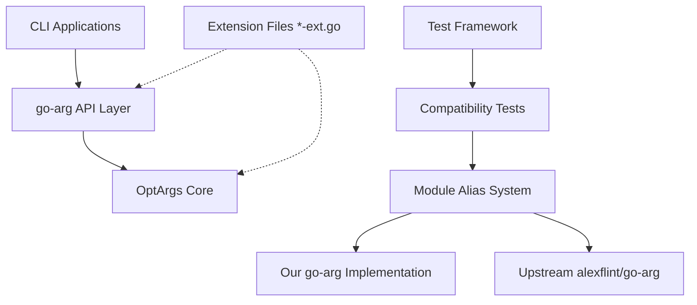

# Design Document

## Overview

This design implements a complete go-arg compatibility layer that provides 100% API compatibility with alexflint/go-arg while leveraging OptArgs Core's POSIX/GNU compliance. The architecture is intentionally simple: go-arg interfaces directly with OptArgs Core without intermediate layers. Extensions are handled architecturally through `-ext.go` files that can be included/excluded at build time.

## Architecture

### Simple Two-Layer Architecture



### Core Principles

1. **Direct Integration**: go-arg interfaces directly with OptArgs Core
2. **Perfect Compatibility**: 100% API compatibility with alexflint/go-arg
3. **Architectural Extensions**: Enhanced features through `-ext.go` files
4. **Build-Time Configuration**: Extensions included/excluded at compile time
5. **Zero Runtime Overhead**: No runtime extension system complexity

## Components and Interfaces

### Main go-arg API (100% Compatible)

```go
// Package goarg provides 100% compatibility with alexflint/go-arg
package goarg

import "github.com/major0/optargs"

// Parser provides the main parsing interface - identical to alexflint/go-arg
type Parser struct {
    config   Config
    dest     interface{}
    metadata *StructMetadata
    
    // Direct OptArgs Core integration
    coreParser *optargs.Parser
    shortOpts  map[byte]*optargs.Flag
    longOpts   map[string]*optargs.Flag
}

// Config matches alexflint/go-arg configuration options exactly
type Config struct {
    Program     string
    Description string
    Version     string
    IgnoreEnv   bool
    // ... all other alexflint/go-arg config fields
}

// Main parsing functions - identical signatures to alexflint/go-arg
func Parse(dest interface{}) error
func ParseArgs(dest interface{}, args []string) error
func MustParse(dest interface{})
func NewParser(config Config, dest interface{}) (*Parser, error)

// Parser methods - identical to alexflint/go-arg
func (p *Parser) Parse(args []string) error
func (p *Parser) WriteHelp(w io.Writer)
func (p *Parser) WriteUsage(w io.Writer)
func (p *Parser) Fail(msg string)
```

### Struct Metadata Processing

```go
// StructMetadata represents parsed struct information
type StructMetadata struct {
    Fields      []FieldMetadata
    Subcommands map[string]*StructMetadata
    Program     string
    Description string
    Version     string
}

// FieldMetadata represents a single struct field's CLI mapping
type FieldMetadata struct {
    Name        string
    Type        reflect.Type
    Tag         string
    Short       string
    Long        string
    Help        string
    Required    bool
    Positional  bool
    Env         string
    Default     interface{}
    
    // Direct OptArgs Core mapping
    CoreFlag    *optargs.Flag
    ArgType     optargs.ArgType
}

// TagParser processes struct tags - identical behavior to alexflint/go-arg
type TagParser struct{}

func (tp *TagParser) ParseStruct(dest interface{}) (*StructMetadata, error)
func (tp *TagParser) ParseField(field reflect.StructField) (*FieldMetadata, error)
```

### Direct OptArgs Core Integration

```go
// CoreIntegration handles direct translation to OptArgs Core
type CoreIntegration struct {
    metadata    *StructMetadata
    shortOpts   map[byte]*optargs.Flag
    longOpts    map[string]*optargs.Flag
    positionals []PositionalArg
}

type PositionalArg struct {
    Field    *FieldMetadata
    Required bool
    Multiple bool
}

// Direct translation methods
func (ci *CoreIntegration) BuildOptString() string
func (ci *CoreIntegration) BuildLongOpts() []optargs.Flag
func (ci *CoreIntegration) CreateParser(args []string) (*optargs.Parser, error)
func (ci *CoreIntegration) ProcessResults(parser *optargs.Parser, dest interface{}) error
```

### Type Conversion System

```go
// TypeConverter handles all Go type conversions - identical to alexflint/go-arg
type TypeConverter struct{}

func (tc *TypeConverter) ConvertValue(value string, targetType reflect.Type) (interface{}, error)
func (tc *TypeConverter) SetField(field reflect.Value, value interface{}) error
func (tc *TypeConverter) GetDefault(field reflect.StructField) interface{}

// Support all alexflint/go-arg types
func (tc *TypeConverter) ConvertString(value string) string
func (tc *TypeConverter) ConvertInt(value string) (int, error)
func (tc *TypeConverter) ConvertBool(value string) (bool, error)
func (tc *TypeConverter) ConvertSlice(values []string, elementType reflect.Type) (interface{}, error)
func (tc *TypeConverter) ConvertCustom(value string, targetType reflect.Type) (interface{}, error)
```

## Data Models

### Struct Tag Processing Examples

```go
// All alexflint/go-arg tag formats must be supported identically
type ExampleStruct struct {
    // Basic options
    Verbose bool   `arg:"-v,--verbose" help:"enable verbose output"`
    Count   int    `arg:"-c,--count" help:"number of items"`
    
    // Required options
    Input   string `arg:"--input,required" help:"input file path"`
    
    // Positional arguments
    Files   []string `arg:"positional" help:"files to process"`
    
    // Environment variables
    Token   string `arg:"--token,env:API_TOKEN" help:"API authentication token"`
    
    // Default values
    Port    int    `arg:"-p,--port" default:"8080" help:"server port"`
    
    // Subcommands
    Server  *ServerCmd `arg:"subcommand:server"`
    Client  *ClientCmd `arg:"subcommand:client"`
}

type ServerCmd struct {
    Port int    `arg:"-p,--port" default:"8080" help:"server port"`
    Host string `arg:"-h,--host" default:"localhost" help:"server host"`
}
```

### OptArgs Core Mapping

```go
// Example of how struct tags map to OptArgs Core flags
type FlagMapping struct {
    StructField *FieldMetadata
    CoreFlag    *optargs.Flag
    ShortOpt    byte    // 'v' for -v
    LongOpt     string  // "verbose" for --verbose
    ArgType     optargs.ArgType
}

// Direct mapping without intermediate layers
func (fm *FlagMapping) ToOptArgsFlag() *optargs.Flag {
    return &optargs.Flag{
        Name:   fm.LongOpt,
        HasArg: fm.ArgType,
    }
}
```

## Architectural Extensions

### Extension File Structure

Extensions are implemented as separate files with `-ext.go` suffix:

```
goarg/
├── parser.go              // Base go-arg implementation
├── tags.go                // Struct tag processing
├── types.go               // Type conversion
├── help.go                // Help generation
├── core_integration.go    // OptArgs Core integration
├── parser_ext.go          // Enhanced parsing features
├── tags_ext.go            // Enhanced tag processing
└── core_integration_ext.go // Enhanced OptArgs Core features
```

### Extension Implementation Pattern

```go
// Base implementation in parser.go
func (p *Parser) Parse(args []string) error {
    // Standard alexflint/go-arg compatible parsing
    return p.parseStandard(args)
}

// Enhanced implementation in parser_ext.go
//go:build extensions
// +build extensions

func (p *Parser) parseWithExtensions(args []string) error {
    // Enhanced parsing with POSIX compaction, GNU features, etc.
    return p.parseEnhanced(args)
}

// Build-time selection
func (p *Parser) Parse(args []string) error {
    if extensionsEnabled {
        return p.parseWithExtensions(args)
    }
    return p.parseStandard(args)
}
```

### Build Configuration

```go
// Build tags for extension control
//go:build extensions
// +build extensions

const extensionsEnabled = true

// Standard build (no extensions)
//go:build !extensions
// +build !extensions

const extensionsEnabled = false
```

## Correctness Properties

*A property is a characteristic or behavior that should hold true across all valid executions of a system-essentially, a formal statement about what the system should do. Properties serve as the bridge between human-readable specifications and machine-verifiable correctness guarantees.*

<function_calls>
<invoke name="prework">
<parameter name="featureName">goarg-compatibility
### Property-Based Testing Overview

Property-based testing (PBT) validates software correctness by testing universal properties across many generated inputs. Each property is a formal specification that should hold for all valid inputs.

### Core Principles

1. **Universal Quantification**: Every property must contain an explicit "for all" statement
2. **Requirements Traceability**: Each property must reference the requirements it validates
3. **Executable Specifications**: Properties must be implementable as automated tests
4. **Comprehensive Coverage**: Properties should cover all testable acceptance criteria

### Converting EARS to Properties

Based on the prework analysis, here are the correctness properties:

**Property 1: Complete API Compatibility**
*For any* valid alexflint/go-arg struct definition and argument list, our go-arg implementation should produce identical parsing results to upstream alexflint/go-arg
**Validates: Requirements 1.1, 1.3**

**Property 2: Struct Tag Format Support**
*For any* valid alexflint/go-arg struct tag format, our tag parser should interpret it identically to upstream alexflint/go-arg
**Validates: Requirements 1.2, 4.1**

**Property 3: OptArgs Core Integration**
*For any* parsing operation, our implementation should leverage OptArgs Core's native parsing capabilities and produce results consistent with OptArgs Core's enhanced POSIX/GNU compliance
**Validates: Requirements 2.2**

**Property 4: Compatibility Test Framework Correctness**
*For any* test scenario, the compatibility framework should correctly identify whether both implementations produce equivalent results
**Validates: Requirements 3.2**

**Property 5: Type Conversion Compatibility**
*For any* Go type supported by alexflint/go-arg, our type converter should handle value conversion identically to upstream alexflint/go-arg
**Validates: Requirements 4.2**

**Property 6: Help Generation Compatibility**
*For any* struct definition, our help generator should produce help text identical in format and content to upstream alexflint/go-arg
**Validates: Requirements 5.1**

**Property 7: Error Message Compatibility**
*For any* invalid input that causes parsing errors, our error messages should match upstream alexflint/go-arg format and wording
**Validates: Requirements 5.2**

**Property 8: Performance Efficiency**
*For any* argument list size, parsing time should scale linearly and be competitive with or better than upstream alexflint/go-arg
**Validates: Requirements 7.1**

## Error Handling

### Direct Error Translation

Error handling maintains perfect compatibility with alexflint/go-arg while leveraging OptArgs Core's enhanced diagnostics:

```go
// Error translation from OptArgs Core to go-arg format
type ErrorTranslator struct{}

func (et *ErrorTranslator) TranslateError(err error, context ParseContext) error {
    switch {
    case strings.Contains(err.Error(), "unknown option"):
        // Match alexflint/go-arg error format exactly
        return fmt.Errorf("unrecognized argument: %s", extractOption(err))
    case strings.Contains(err.Error(), "option requires an argument"):
        return fmt.Errorf("option requires an argument: %s", extractOption(err))
    default:
        // Preserve original error if no specific translation needed
        return err
    }
}

type ParseContext struct {
    StructType reflect.Type
    FieldName  string
    TagValue   string
}
```

### Enhanced Diagnostics (Extensions)

When extension files are included, enhanced diagnostic information is available:

```go
// Enhanced error handling in error_ext.go
//go:build extensions
// +build extensions

func (et *ErrorTranslator) TranslateErrorWithEnhancements(err error, context ParseContext) error {
    baseErr := et.TranslateError(err, context)
    
    // Add enhanced diagnostic information from OptArgs Core
    if diagnostic, ok := err.(*optargs.DiagnosticError); ok {
        return &EnhancedError{
            BaseError:  baseErr,
            Diagnostic: diagnostic,
            Context:    context,
        }
    }
    
    return baseErr
}
```

## Testing Strategy

### Dual Testing Approach

- **Unit tests**: Verify specific functionality and edge cases
- **Property tests**: Verify universal properties across all valid inputs
- **Compatibility tests**: Compare behavior with upstream alexflint/go-arg using module aliases

### Module Alias Testing Framework

```go
// Test framework supports implementation switching
type TestSuite struct {
    scenarios []TestScenario
    upstream  bool  // Switch between implementations
}

type TestScenario struct {
    Name        string
    StructDef   interface{}
    Args        []string
    Expected    interface{}
    ShouldError bool
}

// Run tests against both implementations
func (ts *TestSuite) RunCompatibilityTests() *CompatibilityReport {
    report := &CompatibilityReport{}
    
    for _, scenario := range ts.scenarios {
        // Test our implementation
        ourResult := ts.runWithOurImplementation(scenario)
        
        // Test upstream implementation
        upstreamResult := ts.runWithUpstreamImplementation(scenario)
        
        // Compare results
        comparison := ts.compareResults(ourResult, upstreamResult)
        report.AddComparison(scenario.Name, comparison)
    }
    
    return report
}
```

### Module Alias Configuration

```bash
# Test with our implementation
go mod edit -replace github.com/alexflint/go-arg=./goarg
go test ./compatibility_tests/...

# Test with upstream implementation
go mod edit -dropreplace github.com/alexflint/go-arg
go test ./compatibility_tests/...
```

### Property-Based Testing Configuration

- Minimum 100 iterations per property test
- Each property test must reference its design document property
- Tag format: **Feature: goarg-compatibility, Property {number}: {property_text}**
- Extension tests validate enhanced features when extension files are included

### Test Categories

1. **API Compatibility Tests**
   - All alexflint/go-arg public methods
   - Struct tag parsing equivalence
   - Type conversion equivalence
   - Error handling compatibility

2. **Parsing Behavior Tests**
   - Argument processing equivalence
   - Subcommand handling
   - Environment variable support
   - Default value processing

3. **Help and Usage Tests**
   - Help text generation
   - Usage string formatting
   - Custom descriptions and program names

4. **Extension Tests** (when extension files included)
   - Enhanced POSIX/GNU compliance
   - Advanced OptArgs Core features
   - Performance improvements

5. **Integration Tests**
   - Real-world usage scenarios
   - Complex struct definitions
   - Edge cases and error conditions

This focused approach ensures perfect compatibility with alexflint/go-arg while providing a clean foundation for architectural extensions through `-ext.go` files.